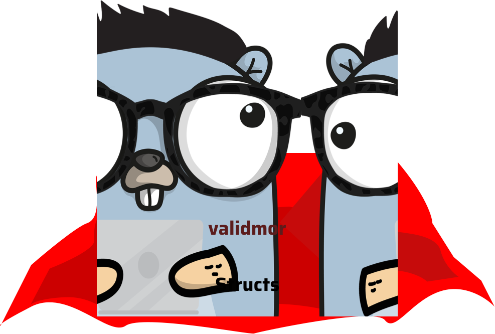

# ValidMor

## multi language - multi-idioma
> valid your structures with labels, you can change the language of the errors or answers in a simple way

> válida tus estructuras con etiquetas, puedes cambiar el idioma de los erros o respuestas de manera sencilla 



## Installation

```bash
go get github.com/Leonardo-Antonio/validmor
```
## Use

- Change lang response (cambio de idioma a las resputas)
  > To be able to change the language of the answers you should only run the Erros function once in your entire project, for now it only supports Spanish and English

  > Para poder cambiar el idioma de las respuestas solo debe ejecutar la función Erros una vez en todo su proyecto, por ahora solo soporta el español e ingles

    ```go
    validmor.Errors(validmor.ERR_EN)
    // ERR_ES -> español
    // ERR_EN -> ingles (defaul)
    ````

- Tags struct 
  - required
  - max
  - min
  - mail
  - url
  > example
  ```go
    type User struct {
        Id    int    `validmor:"number,min=5,max=1000"`
        Name  string `validmor:"string,min=2,max=5"`
        Bio   int    `validmor:"number,required"`
        Email string `validmor:"mail,required"`
    }
  ```

## Example

```go
package main

import (
	"fmt"

	"github.com/Leonardo-Antonio/validmor"
)

type User struct {
	Id    int    `validmor:"number,min=5,max=1000"`
	Name  string `validmor:"string,min=2,max=5"`
	Bio   int    `validmor:"number,required"`
	Email string `validmor:"mail,required"`
	Agent string `validmor:"enum,values=[native;web;social]"`
}

func main() {
	validmor.Errors(validmor.ERR_ES)
	user := User{
		Id:    4,
		Name:  "Leonardo",
		Bio:   0,
		Email: "novalid",
    Agent: "web",
	}

	for _, err := range validmor.ValidateStruct(user) {
		fmt.Printf("%v.- %v\n", i+1, err.Error())
	}

}

```
### Errors Console
```bash
1.- Id debería tener como mínimo 5
2.- Name debe tener menos de 5 caracteres de longitud
3.- Email no es un email valido
```
